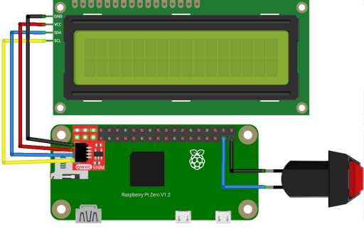

# LCD_Spotify

Display currently playing Spotify track on LCD attached to Raspberry Pi.

## Hardware Installation

### Equipment List

* [Raspberry Pi Zero WH](https://www.adafruit.com/product/3708) or [Raspberry Pi Zero W](https://www.adafruit.com/product/3400)
* [SparkFun Qwiic SHIM for Raspberry Pi](https://www.sparkfun.com/products/15794)
* [STEMMA QT / Qwiic JST SH 4-pin Cable with Premium Female Sockets](https://www.adafruit.com/product/4397)
* SPST Normally Open Momentary switch
* [Adafruit Pi Protector for Raspberry Pi Model Zero](https://www.adafruit.com/product/2883) or other case which exposes the GPIO pins and allows the shim to fit

#### 16x2 LCD Display

* [16x2 LCD Display with I2C backpack](https://www.microcenter.com/product/632704/inland-1602-i2c-lcd-display-module)
* [CANADUINO LCD 1602 16x2 Enclosure](https://www.amazon.com/dp/B07C4XWX21)

#### 20x4 LCD Display

* [20x4 LCD Display with I2C backpack](https://www.amazon.com/GeeekPi-Interface-Adapter-Backlight-Raspberry/dp/B07QLRD3TM)
* [CANADUINO LCD 2004 4x20 Enclosure](https://www.amazon.com/dp/B07Z2XH18C)

### Tools

* Hot glue gun
* 00 Philips Screwdriver
* Soldering iron (if using Raspberry Pi Zero W)

### Wiring Diagram



## Software Installation

Clone this repo to the Raspberry Pi Zero:

```bash
git clone https://github.com/staceybellerose/lcd_spotify.git
```

Create a [Spotify Developer account](https://developer.spotify.com/dashboard).

Create a new [Spotify App](https://developer.spotify.com/documentation/web-api/tutorials/getting-started#create-an-app).

Copy `config.env.sample` to `config.env` and add your Spotify Client ID and Secret.

Install the necessary modules:

```bash
pip install -r requirements.txt
```

Edit `bin/lcd_spotify.sh` to reflect the location of this project.

Copy the scripts to a folder in your path:

```bash
cp bin/* "$HOME"/.local/bin/ # or somewhere else in your $PATH
```

Edit `lcd_spotify.service` to reflect the absolute path of `lcd_spotify.sh`

Copy the unit file to the appropriate folder:

```bash
sudo cp lcd_spotify.service /usr/local/lib/systemd/system/
```

Activate the service:

```bash
sudo systemctl daemon-reload
sudo systemctl enable lcd_spotify.service
sudo systemctl start lcd_spotify.service
```

## Safe Shutdown button

* Connect one side of the button to a GND pin on the Raspberry Pi GPIO header.
* Connect the other side of the button to a numbered GPIO pin.
* Default location is GPIO 3, but this conflicts with I2C bus.
* Add the following line to `/boot/config.txt` replacing `$pin$` with the chosen pin ID.

```bash
dtoverlay=gpio-shutdown,gpio_pin=$pin$
```

<!--
SPDX-FileCopyrightText: © 2022 Stacey Adams <stacey.belle.rose [AT] gmail [DOT] com>

SPDX-License-Identifier: MIT
-->
